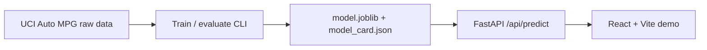

# Architecture

The repository keeps the machine learning code, API, and web demo in one project so the
course submission is easy to run and explain.

The key contract is the serialized scikit-learn pipeline. Preprocessing and the final
regressor are saved together, which keeps API inference aligned with training.

